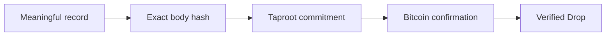

# Drops

**A clear, verifiable artifact layer for Bitcoin.**

Drops gives records, tokens, and agreements a permanent home on Bitcoin through a compact `OP_DROP` commitment. Publish something meaningful, let Bitcoin confirm it, and give everyone the same proof to inspect later.

Universe's production verifier separates public reads from chain scanning and
checks finalized history against two independently operated Bitcoin nodes.
Users keep access to the last fully verified state during controlled catch-up,
and new records appear only after the shared scanner commits a complete block.

Visit the [Drops experience](https://bitcoinuniverse.github.io/drops-protocol/) to discover the protocol in full color.

## One Bitcoin foundation, three expressive layers

| Explore | What Bitcoin preserves | Why it matters |
| --- | --- | --- |
| **Drops artifacts** | A compact body, creator key, stable identity, and proof | A record that stays easy to find and verify. |
| **op-drop tokens** | Strict token events, including [`$DROP`](https://inscribe.bitcoinuniverse.io/op-drop) | Supply and balances follow visible confirmed rules. |
| **Drops Pacts** | Agreement identity, visible terms, state transitions, and proof packs | People can compare what was agreed with what Bitcoin confirmed. |

## Why Drops feels different

- **Exact by design.** The marker, content type, body hash, body, and creator key always appear in one canonical order.
- **Proof before presentation.** A Drop appears only after its body and Taproot commitment agree with confirmed Bitcoin data.
- **Stable identity.** `drops:<network>:<reveal-txid>:d<input-index>` identifies the artifact without a private naming service.
- **Compact and legible.** A native body is capped at 256 bytes, encouraging clear records with durable meaning.
- **Open verification.** The proof belongs to the record, so anyone can check the same confirmed result.

## Choose your experience

- [Discover Drops](pages/discover.html) and see what permanent Bitcoin proof unlocks.
- [Create or verify a Drop](pages/verifier.html) with a simple proof-first flow.
- [Explore op-drop and `$DROP`](pages/op-drop.html) for strict confirmed token events.
- [Design a Pact](pages/studio.html) and make every important term visible before publication.
- [Compare Bitcoin protocols](pages/compare.html) with clear boundaries and no hidden assumptions.

## What a Drop proves

A confirmed Drop proves that exact bytes were committed in a canonical `OP_DROP` leaf and that the leaf belongs to the spent Taproot output. It does not prove off-chain authorship, legal ownership, token balances, or custody beyond what the record itself contains.

Bitcoin transactions are difficult to reverse. Review the content, network, destination, and fee in your wallet before signing. Never share a seed phrase or private key with a website or support account.

## Explore the protocol

- [Drops protocol](pages/protocol.html)
- [Canonical artifact rules](pages/drops-specification.html)
- [Supported carriers](pages/carriers.html)
- [Drops Pacts](pages/pacts.html)
- [Pacts Studio](pages/studio.html)

The protocol is **Drops**. One artifact is **a Drop**. Its identity always follows `drops:<network>:<reveal-txid>:d<input-index>`.
