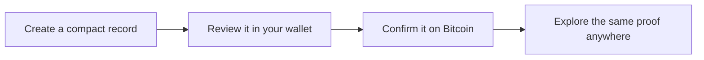

# Drops: a compact proof layer for Bitcoin

A Drop gives a small record a permanent Bitcoin home. Its content, content
type, creator key, and Taproot commitment travel together, creating one proof
that compatible explorers can show in many different ways.

## What makes a Drop memorable

- **Exact content.** The record preserves the same compact bytes everyone can
  inspect.
- **Visible proof.** The body hash and Bitcoin commitment can be compared
  directly.
- **Stable identity.** A Drop keeps the same network, transaction, and input
  identity wherever it appears.
- **Open presentation.** Galleries can look different while following the same
  confirmed record.

## The journey



Every Drop has a portable identity shaped like:

```text
drops:<network>:<reveal-transaction>:d<input>
```

The identity points back to the Bitcoin evidence instead of relying on a
private naming service.

## How confirmed records stay available

The Universe explorer serves verified records from read-only API replicas while
one scanner advances the shared chain cursor. The scanner compares finalized
block hashes from two independently operated Bitcoin nodes and commits Drops
and token projections together. If catch-up or recovery is required, existing
committed records remain available and no partial block is published as a new
confirmed result.

## What the proof says

A confirmed Drop shows that its exact content belongs to the committed Taproot
record. It does not make claims about off-chain authorship, legal ownership, or
market value beyond what the record itself proves.

Before creating one, review the content, receiving address, network, and fee in
a wallet you trust. Bitcoin transactions are difficult to reverse, and a
legitimate Drops experience never asks for a seed phrase or private key.

[Discover Drops](../pages/discover.html) or follow the
[friendly verification journey](../pages/verifier-guide.html).
