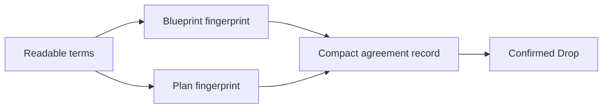

# The Pacts Studio agreement record

Pacts Studio turns the agreement people reviewed into one compact Bitcoin
record. It pairs the finished blueprint with the finished plan, giving every
party the same lasting reference.

## One shared memory for the agreement

The two fingerprints do not reveal private keys or signing material. They let
people compare the agreement they saved with the record Bitcoin confirmed.

## What you can do with it

- Return to the exact agreement identity after publication.
- Compare saved terms with the confirmed record.
- Share one compact reference with every participant.
- Follow the record from the Pacts experience into a Bitcoin explorer.
- Keep the completed agreement understandable even when its presentation
  changes.

## A simple participant journey

1. Shape the agreement in Pacts Studio.
2. Review every visible term with the other participants.
3. Save the completed agreement details.
4. Approve the Bitcoin action only in a wallet you trust.
5. Wait for confirmation, then compare the confirmed record with what you
   saved.

The record proves the exact compact reference committed to Bitcoin. It does not
replace legal advice, custody review, or careful wallet inspection. Never share
a seed phrase or private key with a website or support account.

[Open Pacts Studio](../pages/studio.html) or learn
[how the agreement journey works](../pages/pacts.html).
